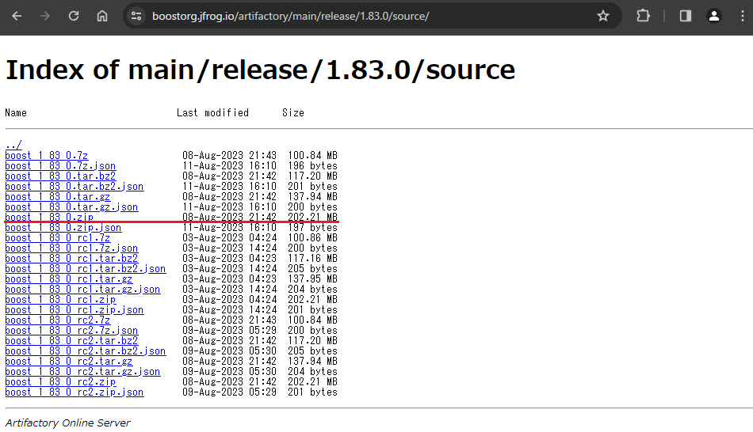

# 環境構築手順書

# 1 本書について

本書では、LOD1道路モデル自動生成ツール（以下「本ツール」という。）の環境構築手順について記載しています。

# 2 動作環境

本ツールの動作環境は以下のとおりです。

| 項目               | 最小動作環境               | 推奨動作環境                   |
| ------------------ | ------------------------- | ------------------------------ |
| OS                 | Microsoft Windows 10 または 11 | 同左 |
| CPU                | Intel Core i7以上 | 同左 |
| メモリ             | 16GB以上 | 32GB以上 |
| HDD空き容量        | 1GB以上 | 5GB以上 |
| ネットワーク       | 不要 | 同左 |

# 3 インストール手順

[こちら](https://github.com/Project-PLATEAU/Auto-Create-tran-lod1-2-tool/releases)
からアプリケーションをダウンロードします。

ダウンロード後、zipファイルを右クリックし、「すべて展開」を選択することで、zipファイルを展開します。

展開されたフォルダ内の「AutoCreateLod1Road.exe」と「ConvertShapeToCityGML.exe」がLOD1道路自動生成ツールのアプリケーションです。
二つのアプリケーションはコンソールアプリケーションのため、コマンドプロンプトなどのコンソールから使用可能です。


# 4 ビルド手順

自身でソースファイルをダウンロードしビルドを行うことで、実行ファイルを生成することができます。\
ビルドにはVisualStudio2019を使用するため、事前にVisualStudio2019をインストールする必要があります。 \
ソースファイルは
[こちら](https://github.com/Project-PLATEAU/Auto-Create-tran-lod1-2-tool)
からダウンロード可能です。

GitHubからダウンロードしたソースファイルの構成は以下のとおりです。


ビルド時に本ツールが参照しているBoost C++ Librariesが必要なため、以下からboost_1_83_0.zipをダウンロードしてください。 \
[Boost C++ Libraries ver.1.83.0](https://boostorg.jfrog.io/artifactory/main/release/1.83.0/source/)



## 4-1 Boost C++ Libraries のビルド

Boost C++ Librariesのビルドには約3GBのHDD容量が必要になります。

（1）事前にダウンロードしたboost_1_83_0.zipを解凍します。 \
本書では、C:\work下に解凍したものとし、C:\work\boost_1_83_0以下のファイル構成は下図のとおりです。


（2）コマンドプロンプトを使用してBoost C++ Librariesのビルドします。 \
コマンドプロンプトを起動し、カレントディレクトリを（1）で解凍したboost_1_83_0フォルダに移動します。 \
そして、bootstrapコマンドを実行します。 \
次に、b2コマンドを使用してライブラリをビルドします。 \
b2コマンドのオプションについては以下に示すとおりです。

| オプション          | 説明                      |
| ------------------ | ------------------------- |
| --build-dir        | ビルドディレクトリのパス。 |
| address-model      | 64 : 64bitのライブラリを作成します。 <br> 32 : 32bitのライブラリを作成します。|
| -j（数字）          | 並列ビルド設定。複数のCPUを使用してビルドすることが可能です。 <br> 数字部分は自マシンのスペックによって変更してください。 |
| --includedir       | 指定したパスにインクルードヘッダファイルを出力します。 |
| --libdir           | 指定したパスにライブラリファイルを出力します。 |

【コマンド例】 \
解凍したライブラリがC:\work\boost_1_83_0

```
# cd C:\work\boost_1_83_0
# bootstrap
# b2 --build-dir=build/x64 address-model=64 -j4 install --includedir=C:\work\lib\boost_1_83_0\include --libdir=C:\work\lib\boost_1_83_0\lib\x64
```


【ビルド結果】


（3）ビルド結果のインクルードヘッダファイルとライブラリファイルをソースフォルダに移動します。 \
【インクルードヘッダファイルのコピー】 \
（b2コマンドの--includedirで指定したパス）\boost-1_83\boostフォルダ を \
（ソースコードの保存先パス）\Auto-Create-tran-lod1-2-tool\lod1\src\LIB\boost_1_83_0\include下にコピーします。

【ライブラリファイルのコピー】 \
（b2コマンドの--includedirで指定したパス）内のファイルを \
（ソースコードの保存先パス）\Auto-Create-tran-lod1-2-tool\lod1\src\LIB\boost_1_83_0\lib\x64にコピーします。

本ツールのソースコードがC:\work以下に設置されており、ライブラリビルド時のb2コマンドの--includedirオプションがC:\work\lib\boost_1_83_0\include、--libdirオプションがC:\work\lib\boost_1_83_0\lib\x64の場合のコピー元、コピー先のフォルダパスは以下のとおりです。

| 項目                     | コピー元フォルダパス            | コピー先フォルダパス        |
| ------------------------ | ----------------------------- | ------------------------- |
| インクルードヘッダファイル | C:\work\lib\boost_1_83_0\include\boost-1_83\boost | C:\work\Auto-Create-tran-lod1-2-tool\lod1\src\LIB\boost_1_83_0\include\boost |
| ライブラリファイル        | C:\work\lib\boost_1_83_0\lib | C:\work\Auto-Create-tran-lod1-2-tool\lod1\src\LIB\boost_1_83_0\lib |

【ライブラリコピー後のソースコードフォルダ構成】


## 4-2 Lod1道路自動生成ツールのビルド

（1）本ツールのソリューションファイル（AutoCreateLod1Road.sln）をVisualStudio2019で開きます。

ソリューションファイルは、Auto-Create-tran-lod1-2-tool\lod1\src\EXE\AutoCreateLod1Roadに格納されています。

（2）AutoCreateLod1Road.slnをVisualStudio2019で開くと、ソリューション'AutoCreateLod1Road'に3つのプロジェクトが表示されます。

以下の赤枠部分のように、ソリューション構成を【Release】に、ソリューションプラットフォームを【x64】に設定します。


（3）以下の赤枠部分のように、\[ソリューションのビルド\]を選択し、ソリューション全体をビルドします。


（4）ビルドが正常に終了すると、ソリューションファイルと同じフォルダにあるx64\Releaseフォルダに実行ファイルが生成されます。 \
以下赤枠内のファイルがアプリケーション実行時に必要なファイルです。


| ファイル名                  | 説明                      |
| -------------------------- | ------------------------- |
| AutoCreateLod1Road.exe     | LOD1道路モデル自動生成ツール |
| ConvertShapeToCityGML.exe  | LOD1道路モデルのシェープファイルをCityGMLファイルに変換するツール|
| shapelib.dll               | シェープファイル入出力ライブラリ |
