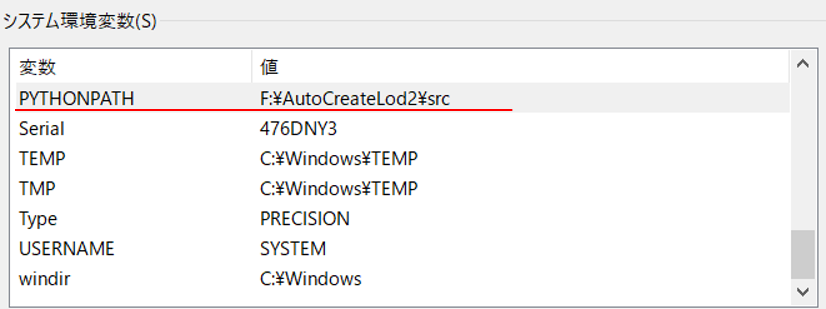
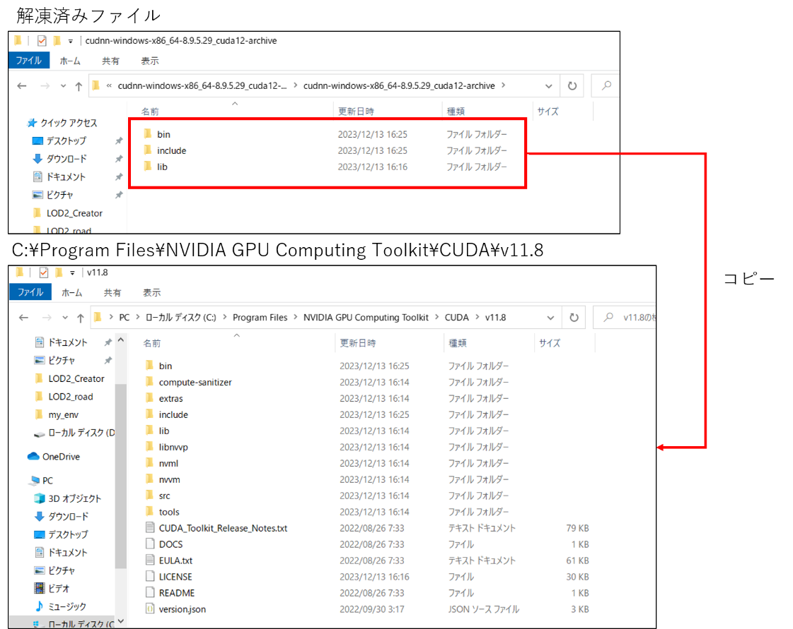
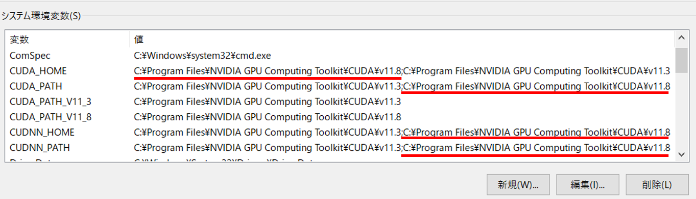

# 環境構築手順書

# 1 本書について

本書では、LOD2道路モデル自動生成ツール（以下「本ツール」という。）の環境構築手順について記載しています。

# 2 動作環境

本ツールの動作環境は以下のとおりです。

| 項目               | 推奨動作環境               |
| ------------------ | ------------------------- |
| OS                 | Microsoft Windows 10 または 11 |
| CPU                | Intel Core i7以上 |
| メモリ             | 16GB以上 |
| GPU                | NVIDIA RTX 5000以上 |
| GPU メモリ         | 16GB以上 |
| ネットワーク       | 不要 |

# 3 ソフトウェア環境

本ツールは、Python(バージョン3.9以上)のインストールが必要です。
以下のPythonライブラリを必要とします。

<ライブラリ一覧>

| ライブラリ名           | ライセンス                 | 説明        |
| ------------------    | ------------------------- | ------------------------- |
| tqdm MIT License      | Mozilla Public License 2.0                 | プログレスバーの表示 |
| shapely               | BSD License (BSD 3-Clause)                 | 幾何計算 |
| numpy                 | BSD License (BSD-3-Clause)                 | 数値計算 |
| Pillow                | Historical Permission Notice and Disclaimer| 画像の読み書き |
| PyYAML                | MIT License                                | yamlファイルの読み書き |
| pyproj                | MIT License                                | 座標系の変換 |
| pyshp                 | MIT License                                | シェープファイルの読み書き |
| lxml                  | BSD License (BSD-3-Clause)                 | XMLファイルの読み書き |
| torch                 | BSD License (BSD-3)                        | 機械学習 |
| torchvision           | BSD                                        | 機械学習 |
| lightning             | Apache Software License (Apache-2.0)       | 機械学習 |
| opencv-python         | Apache Software License (Apache 2.0)       | 画像の読み書き、画像処理 |
| opencv-contrib-python | Apache Software License (Apache 2.0)       | 画像処理 |
| networkx              | BSD License                                | グラフ構造の管理 |
| shapelysmooth         | Public Domain (Unlicense)                  | 幾何のスムージング処理 |
| geopandas             | BSD License (BSD 3-Clause)                 | シェープファイルの書き出し |
| sortedcontainers      | Apache Software License (Apache 2.0)       | ソート済みコレクションの管理 |
| openmim               | Apache 2.0 license OpenMMLab               | ライブラリの管理 |
| mmcv                  | Apache Software License                    | 機械学習 |
| mmsegmentation        | Apache Software License (Apache License 2.0) | 機械学習 |
| mmdet                 | Apache Software License (Apache License 2.0) | 機械学習 |

# 4 仮想環境の作成

専用環境を作成しツールを実行する場合、仮想環境を構築することを推奨します。\
例として以下にvenvを使用した仮想環境の作成手順を示します。\
venv は Python の標準ツールであるため、インストールは不要です。なお、コマンドプロンプト上での操作とします。

## 4-1 作成

以下のコマンドを使用し、仮想環境を作成します。一度実施すれば良いです。

```
> cd [仮想環境を作成するフォルダパス]
> py -[Pythonのインストールバージョン] -m venv [仮想環境名]
```

[Pythonのインストールバージョン]：例として「3.9」など\
[仮想環境名]：任意の名称

## 4-2 切り替え

以下のコマンドを使用し、作成した環境へ切り替えを行います。

```
> cd [仮想環境を作成したフォルダパス]
> [仮想環境名]\Scripts\activate.bat
```

[仮想環境名]：作成した仮想環境名

## 4-3 終了

仮想環境を終了する場合には以下のコマンドを使用し、切り替えた環境を終了します。\
このまま環境構築を実施する場合には終了する必要はありません。

```
> deactivate
```

# 5 システム環境の構築

本ツールを実行するための環境構築として、システム環境変数の登録と仮想環境へ依存ライブラリのインストールを行います。\
なお、依存ライブラリのインストールで使用するrequirements.txtはツールのフォルダ内に同梱しています。

## 5-1 システム環境変数の登録

| 変数名          | 値 |
| -------------- | -------- |
| PYTHONPATH     | F:\AutoCreateRoadLod2\src (本ツールのsrcフォルダまでのパス) |

<システム環境構築におけるシステム環境変数の登録>



## 5-2 依存ライブラリのインストール

以下コマンドを使用して、仮想環境に依存ライブラリをインストールします。\
requirements.txtは、本ツールのソースコードに同梱しています。

```
> pip install –r requirements.txt
```

# 6 GPU環境の構築

GPU環境の構築方法を以下に示します。なお、手順6-1～6-4はPCに対して一度設定すれば良いです。\
手順6-5以降に関しては、仮想環境ごとに設定する必要があります。

[GPU環境構築時の注意点]\
仮想環境に、torch、 torchvisionライブラリ、拡張モジュールをインストールする作業は、システム環境の構築後に行う必要があります。

## 6-1 Build Tools for Visual Studioのインストール

以下より、Build Tools for Visual Studio 2017、または、Build Tools for Visual Studio 2019をダウンロードし、インストールします。\
なお、Visual Studio 2017 、または、Visual Studio 2019のインストールでも良いです。

[https://visualstudio.microsoft.com/ja/downloads/](https://visualstudio.microsoft.com/ja/downloads/)

## 6-2 cuda toolkit 11.8のインストール

以下より、cuda toolkit 11.8 をダウンロードし、インストールします。\
なお、インストールオプションはデフォルト値のままで良いです。

[https://developer.nvidia.com/cuda-11-8-0-download-archive](https://developer.nvidia.com/cuda-11-8-0-download-archive)

## 6-3 cuDNNのインストール

以下よりcuDNNをダウンロードします。

[https://developer.nvidia.com/rdp/cudnn-download](https://developer.nvidia.com/rdp/cudnn-download (Opens in new window or tab))

ダウンロードした「cudnn-windows-x86_64-8.9.5.29_cuda12-archive」を解凍します。\
解凍したファイルを「C:\Program Files\NVIDIA GPU Computing Toolkit\CUDA\v11.8」以下の該当フォルダにコピーします。

<cuDNNのインストール>



## 6-4 システム環境変数の追加

システム環境変数に、以下の4変数を登録します。4変数の値は、共通とします。

| 変数名          | 値 |
| -------------- | -------- |
| CUDA_HOME, CUDA_PATH, CUDNN_HOME, CUDNN_PATH     | C:\Program Files\NVIDIA GPU Computing Toolkit\CUDA\v11.8 |

<GPU環境構築におけるシステム環境変数の登録>



## 6-5 torch, torchvisionのインストール

仮想環境に、torch, torchvisionをインストールします。

```
> pip install torch==2.0.1+cu118 torchvision==0.15.2+cu118 --extra-index-url https://download.pytorch.org/whl/cu118
```

## 6-6 モデル学習チェックポイントファイルの配置

以下よりckptファイルをダウンロードします。 \
本ツールの「src\steps」の下にdataフォルダを作成し、ダウンロードしたckptファイルを「src\steps\data」に置きます。

[モデル学習チェックポイントファイル](https://drive.google.com/file/d/1xxmczuzeZJuFUpXQ7mufPk6STjloLeZy/view?usp=drive_link)
