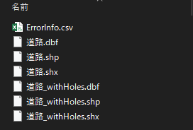

# 操作マニュアル

# 1 本書について

本書では、LOD1道路モデル自動生成ツールの操作手順について記載しています。

# 2 ツール構成

LOD1道路モデル自動生成ツールは、道路のシェープファイルを読み込みLOD1道路モデルのシェープファイルを作成する「AutoCreateLod1Road.exe」と、LOD1道路モデルのシェープファイルをCityGMLファイルに変換する「ConvertShapeToCityGML.exe」の二つのアプリケーションで構成しています。


# 3 使い方

## 3-1 LOD1道路モデル自動生成

本節では、道路のシェープファイルを読み込みLOD1道路モデルのシェープファイルを作成する「AutoCreateLod1Road.exe」を本ツールとします。

### 3-1-1 入力シェープファイルの作成

LOD1道路モデル自動生成では、道路のシェープファイルと道路施設のシェープファイルを入力データとして使用します。（道路施設のシェープファイルは任意入力ファイルです。） \
本ツールのユースケースでは、[公共測量成果検査支援ツール](https://psgsv2.gsi.go.jp/koukyou/public/sien/pindex.html#psea03)を使用して、地図情報レベル2500のDM（Digital Mapping）データから道路と道路施設のシェープファイル（\*.shp、\*.shx、\*.dbf、\*.prj）を作成することを想定しています。 \
シェープファイルの座標系は、平面直角座標系を想定しています。


| シェープファイル      | 説明                            |
| -------------------- | ------------------------------ |
| 道路                 | 道路のシェープファイル          |
| 道路施設_1           | 点形状の道路施設のシェープファイル |
| 道路施設_3           | 線形状の道路施設のシェープファイル |
| 道路施設_5           | 面形状の道路施設のシェープファイル |

シェープファイルには以下の属性データが必要です。

| 属性                        | 説明                            |
| --------------------------- | ------------------------------ |
| 数値地形図データ取得分類コード | DMデータの種別（道路縁（街区線）、道路橋（高架部）、道路のトンネル）判定に使用します。 <br> データ形式は4桁の整数値です。|
| 図形区分                     | DMデータを図面出力する際に必要となる図形区分です。 <br> 道路施設データを取得する際の選別処理で使用します。 <br> データ形式は整数値です。 |


本ツールで使用する数値地形図データ取得分類コードは以下のとおりです。

| 数値地形図データ取得分類コード | 説明           |
| --------------------------- | -------------- |
| 2101                        | 道路縁（街区線） |
| 2203                        | 道路橋（高架部） |
| 2219                        | 道路のトンネル   |

本ツールで使用する図形区分コードは以下のとおりです。

| 図形区分 | 説明   |
| ------- | ------ |
| 0       | 非区分 |

### 3-1-2 入力パラメータファイルの作成

LOD1道路モデル自動生成で使用するパラメータを記載した入力パラメータファイルを作成します。 \
入力パラメータファイルの文字コードはShift_JISです。

【入力パラメータファイル例】

```text:create_param.txt
[Setting]
RoadSHPPath = C:/work/data/DM_SHP/道路.shp
RoadFacilitiesPointSHPPath = C:/work/data/DM_SHP/道路施設_1.shp
RoadFacilitiesLineSHPPath = C:/work/data/DM_SHP/道路施設_3.shp
RoadFacilitiesPolygonSHPPath = C:/work/data/DM_SHP/道路施設_5.shp
JPZone = 9
RegionWidth = 1500
RegionHeight = 2000
ThreadNum = 8
OutputFolderPath = C:/work/output

[DM_Attribute]
DMCode = 分類コーA
GeometryType = 図形区分

[ErrCheck]
MinArea = 10.0
MaxDistance = 10.0
```

| グループ      | 設定項目                      | 説明                                        |
| ------------ | ---------------------------- | ------------------------------------------- |
| Setting      | RoadSHPPath                  | 道路シェープファイルパス（\*.shp）※1          |
|              | RoadFacilitiesPointSHPPath   | 道路施設（点）シェープファイルパス（\*.shp）※1 |
|              | RoadFacilitiesLineSHPPath    | 道路施設（線）シェープファイルパス（\*.shp）※1 |
|              | RoadFacilitiesPolygonSHPPath | 道路施設（線）シェープファイルパス（\*.shp）※1 |
|              | JPZone | シェープファイルで使用している平面直角座標系の系番号（入力範囲 : 1-19） |
|              | RegionWidth | 道路縁データを分割して道路モデルを作成する際のモデル作成対象領域の幅。 <br> 入力値は整数とし、単位はm（メートル）です。 |
|              | RegionHeight | 道路縁データを分割して道路モデルを作成する際のモデル作成対象領域の高さ。 <br> 入力値は整数とし、単位はm（メートル）です。 |
|              | ThreadNum | 道路モデル作成時のマルチスレッド数。入力値は1以上の整数値とし、自マシンのスペックに合わせて設定してください。 |
|              | OutputFolderPath | 出力フォルダパス |
| DM_Attribute | DMCode | 入力シェープファイルおける数値地形図データ取得分類コードの属性名 |
|              | GeometryType | 入力シェープファイルにおける図形区分の属性名 |
| ErrCheck     | MinArea | 小領域道路ポリゴンのエラーチェックの際に使用する面積閾値。単位は、m^2（平方メートル）です。 |
|              | MaxDistance | 車道交差部ポリゴンの中心が交差点から離れていないか確認するための距離閾値。単位はm（メートル）です。 |

※1　シェープファイルパス（\*.shp）が記載された同階層に、同名のshx、dbf、prjの拡張子のファイルが存在する想定です。


### 3-1-3 LOD1道路モデルの作成

入力シェープファイルと入力パラメータファイルの準備が整っている状態で、コマンドプロンプトより「AutoCreateLod1Road.exe」を実行してLOD1道路モデルを作成します。
実行コマンドは以下のとおりです。

```
# AutoCreateLod1Road.exe 入力パラメータファイルパス
```

【コマンド例】 \
「AutoCreateLod1Road.exe」と入力パラメータ「create_param.txt」がC:\work\AutoCreateLod1Roadに存在している想定です。

```
# cd C:\work\AutoCreateLod1Road
# AutoCreateLod1Road.exe create_param.txt
```


作成したLOD1道路モデルは、入力パラメータファイルの「OutputFolderPath」に指定したフォルダパスに出力されます。 \
LOD1道路モデルは、車道交差部や橋梁、トンネルなどの道路構造変化部分において道路モデルを分割する仕様のため、道路モデルの幾何形状は穴がないポリゴンとなりますが、本ツールでは道路モデルの分割処理が失敗する場合も考慮し、ポリゴンの穴を無視したシェープファイルと、ポリゴンの穴を考慮したシェープファイルを出力します。



| 出力ファイル            | 説明                   |
| ---------------------- | ---------------------- |
| LOD1道路モデル（穴無視） | LOD1道路ポリゴン（ポリゴンの穴は無視）のシェープファイル。 <br> ファイル名は、入力道路シェープファイルと同名です。 |
| LOD1道路モデル（穴考慮） | LOD1道路ポリゴン（ポリゴンの穴を考慮）のシェープファイル。 <br> ファイル名は、入力道路シェープファイル名_withHolesです。 |
| エラーモデル情報         | エラーが発生しているLOD1道路モデルのエラー内容と位置情報を記載したCSVファイル。 <br> ファイル名は、ErrorInfo.csvです。 |

LOD1道路モデルシェープファイルは、道路モデルの幾何情報と属性情報として道路構造種別を保持します。

| 属性                    | 説明                            |
| ---------------------- | --------------------------------|
| 道路構造種別（sectType） | CityGMLのuro:RoadStructureAttributeのuro:sectionTypeに該当する属性情報。データ形式は整数値です。 <br> 本ツールでは、高架橋は2、車道交差部は4、トンネルは6、その他の道路モデルは未入力（NULL）とします。 |

エラーモデル情報は、エラーが発生しているLOD1道路モデルのエラー内容と位置情報を保持しています。ファイルの文字コードはUTF-8です。

【エラーモデル情報例】

```text:ErrorInfo.csv
ERROR,X,Y
TOPOLOGICAL_INVAILD_ERR, -35305.38, -64644.52
```

| エラー内容                         | 説明                            |
| --------------------------------- | --------------------------------|
| MISSING_MODEL_ERR                 | 出力結果の道路モデルと車道交差部等で分割する前の道路モデルを比較した結果、出力結果の道路モデルが欠落しています。 |
| TOPOLOGICAL_INVAILD_ERR           | 道路モデルに自己交差や自己接触等のトポロジー不正が発生しています。 |
| TOPOLOGICAL_SHORTAGE_POINT_ERR    | 道路モデルの始終点が同一座標ではありません。 |
| TOPOLOGICAL_DUPLICATION_POINT_ERR | 道路モデルの頂点列に重複頂点が存在します。 |
| ANGLE_ERR                         | 道路モデルに鋭角（0-45deg）な内角が発生しています。 |
| INTERSECTION_MISMATCH_ERR         | 交差点座標を内包しない車道交差部が存在します。 |
| INTERSECTION_SAME_POINT_ERR       | 同一交差点座標を内包する車道交差部が複数存在します。 |
| INTERSECTION_DIFFERENT_POINT_ERR  | 車道交差部内に複数の交差点座標が存在します。 |
| EXCESS_ERR                        | 出力結果の道路モデルと車道交差部等で分割する前の道路モデルを比較した結果、出力結果の道路モデルが分割前の道路モデルからからはみ出しています。 |
| SUPERIMPOSE_ERR                   | 車道交差部同士で重畳しています。 |
| WITHIN_ERR                        | 車道交差部に内包されている車道交差部が存在します。 |
| ROAD_DIVISION_ERR                 | 車道交差部の分岐数と車道交差部の外輪郭線から道路縁と重畳する部分を除いたポリラインの本数が一致しません。 |
| MINUSCULE_POLYGON_ERR             | 入力パラメータの「MinArea」より小さい面積の道路モデルが存在します。 |
| INTERSECTION_DISTANCE_ERR         | 車道交差部の中心と交差点座標間の距離が、入力パラメータの「MaxDistance」より大きい道路モデルが存在します。 |

## 3-2 CityGML変換

本節では、LOD1道路モデルのシェープファイルをCityGMLファイルに変換する「ConvertShapeToCityGML.exe」を本ツールとします。

### 3-2-1 入力シェープファイルの準備

本ツールでは、道路面のシェープファイルを入力データとして使用します。 \
シェープファイルはLOD1道路面の幾何情報と属性情報を保持しています。 \
属性情報に関しては、マップファイルにて入力シェープファイルと出力CityGMLの属性情報の対応付けを行うため、CityGML変換に不必要な属性を含んでいても問題はありません。 \
シェープファイルの座標系は、平面直角座標系を想定しています。

【入力シェープファイル例】


### 3-2-2 マップファイルの作成

マップファイルは、入力シェープファイルと出力CityGMLの属性情報の対応付けを行うためルールを記載したCSVファイルです。 \
マップファイルは以下のファイルフォーマットのとおりに、1行に1属性ずつ変換対象の設定を記載します。

| 項目            | 説明                   |
| --------------- | ---------------------- |
| SettingAttrFlg  | 変換対象とするか否かを指定するフラグ（1 : ON、0 : OFF） |
| CityGMLAttrName | CityGMLの属性名 |
| SHPAttrName     | シェープファイルの属性名 |

マップファイルのCityGMLの属性名として使用可能な項目は以下のとおりです。

| CityGMLAttrName | 説明                   |
| --------------- | ---------------------- |
| gml:description | 道路の概要 |
| gml:name | 道路を識別する名称 <br> 道路法に基づき路線が指定又は認定された路線名 |
| core:creationDate | データが作成された日 |
| core:terminationDate | データが削除された日 |
| tran:class | 交通分類 |
| tran:function | 道路法における道路の区分及び建築基準法における道路の区分 |
| tran:usage | 道路の利用方法 |
| uro:dmCode | 公共測量標準図式の図式分類コード |
| uro:meshCode | 数値地形図データファイル仕様にもとづいて設定される図郭識別番号 |
| uro:srcScale | 元となるデータの地図情報レベル |
| uro:geometrySrcDesc | 幾何オブジェクトを作成する元となるデータの説明 |
| uro:thematicSrcDesc | 主題属性を作成する元となるデータの説明 |
| uro:widthType | 幅員の区分 |
| uro:width | 中央帯、車道、路肩、植樹帯、歩道等及び環境施設帯（環境施設帯の中の路肩、植樹帯、歩道等の部分を除いた部分）の幅員を合計した値 |
| uro:numberOfLanes | 上下線の合計（一方通行区間の場合を除く）の車線数 |
| uro:sectionType | 道路構造の種別 |
| uro:sectionID | 交通量調査において、調査の単位となる交通調査基本区間に付与される番号（原則として、「都道府県（2桁）」+「道路種別（1桁）」+「路線番号（4桁）」+「順番号（4桁）」からなる11桁の番号） |
| uro:routeName | 路線名 |
| uro:weekday12hourTrafficVolume | 平日7時～19時までに通過する車両台数 |
| uro:weekday24hourTrafficVolume | 平日7時～翌朝7時又は0時～翌日0時までに通過する車両台数 |
| uro:largeVehicleRate | 自動車類交通量に対する大型車交通量の割合 |
| uro:congestionRate | 交通調査基本区間の交通容量に対する交通量の比 |
| uro:averageTravelSpeedInCongestion | 朝のラッシュ時間帯（7時～9時）又は夕方のラッシュ時間帯（17時～19時）において平均旅行速度を集計し、その遅い方の時間帯の旅行速度 |
| uro:averageInboundTravelSpeedCongestion | 朝のラッシュ時間帯（7時～9時）又は夕方のラッシュ時間帯（17時～19時）において上り線における平均旅行速度を集計し、その遅い方の時間帯の旅行速度 |
| uro:averageOutboundTraelSpeedInCongestion | 朝のラッシュ時間帯（7時～9時）又は夕方のラッシュ時間帯（17時～19時）において下り線における平均旅行速度を集計し、その遅い方の時間帯の旅行速度 |
| uro:averageInboundTravelSpeedNotCongestion | 昼間非混雑（9時～17時）における上り線の平均旅行速度 |
| uro:averageOutboundTravelSpeedNotCongestion | 昼間非混雑（9時～17時）における下り線の平均旅行速度 |
| uro:observationPointName | 交通量等を観測した地点の名称 |
| uro:reference | 対象となる道路の区間を図上で域別する番号 |
| uro:surveyYear | 調査が実施された年 |

【マップファイル例】

```CSV:map.csv
SettingAttrFlg,CityGMLAttrName,SHPAttrName
1,gml:description,desc
1,gml:name,name
1,core:creationDate,createDate
1,core:terminationDate,termDate
1,tran:class,class
1,tran:function,func
1,tran:usage,usage
1,uro:dmCode,dmCode
1,uro:meshCode,meshCode
1,uro:srcScale,srcScale
1,uro:geometrySrcDesc,geomDesc
1,uro:thematicSrcDesc,themDesc
1,uro:widthType,widthType
1,uro:width,width
1,uro:numberOfLanes,numOfLanes
1,uro:sectionType,sectType
1,uro:sectionID,sectID
1,uro:routeName,routeName
1,uro:weekday12hourTrafficVolume,12hTrafVol
1,uro:weekday24hourTrafficVolume,24hTrafVol
1,uro:largeVehicleRate,lgVehRate
1,uro:congestionRate,cgstnRate
1,uro:averageTravelSpeedInCongestion,ATSIC
1,uro:averageInboundTravelSpeedCongestion,AIBTSIC
1,uro:averageOutboundTraelSpeedInCongestion,AOBTSIC
1,uro:averageInboundTravelSpeedNotCongestion,AIBTSNC
1,uro:averageOutboundTravelSpeedNotCongestion,AOBTSNC
1,uro:observationPointName,obsPtName
1,uro:reference,ref
1,uro:surveyYear,survYear
```

### 3-2-3 パラメータファイルの作成

本ツールで使用するパラメータを記載した入力パラメータファイルを作成します。 \
入力パラメータファイルの文字コードはShift_JISです。

【入力パラメータファイル例】

```text:conv_param.txt
[Setting]
LOD1RoadSHPPath = C:/work/conv/input/LOD1Road.shp
JPZone = 6
MapFilePath = C:/work/conv/input/map.csv
OutputFolderPath = C:/work/conv/output
```

| グループ      | 設定項目         | 説明                                      |
| ------------ | ---------------- | ----------------------------------------- |
| Setting      | LOD1RoadSHPPath  | LOD1道路面シェープファイルパス（\*.shp） ※2 |
|              | JPZone           | シェープファイルで使用している平面直角座標系の系番号（入力範囲 : 1-19） |
|              | MapFilePath      | マップファイルパス |
|              | OutputFolderPath | 出力フォルダパス   |

※2　シェープファイルパス（\*.shp）が記載された同階層に、同名のshx、dbf、prjの拡張子のファイルが存在する想定です。

### 3-2-4CityGML変換

入力シェープファイル、マップファイル及び入力パラメータファイルの準備が整っている状態で、コマンドプロンプトより「ConvertShapeToCityGML.exe」を実行してLOD1道路面シェープファイルをCityGMLファイルに変換します。
実行コマンドは以下のとおりです。

```
# ConvertShapeToCityGML.exe 入力パラメータファイルパス
```

【コマンド例】 \
「ConvertShapeToCityGML.exe」と入力パラメータ「conv_param.txt」がC:\work\AutoCreateLod1Roadに存在している想定です。

```
# cd C:\work\AutoCreateLod1Road
# ConvertShapeToCityGML.exe ./conv_param.txt
```


作成したCityGMLファイルは、入力パラメータファイルの「OutputFolderPath」に指定したフォルダパスに出力されます。 \
出力CityGMLファイルは基準地域メッシュ（第3次地域区画）単位のデータとなっています。なお、CityGMLファイルは1ファイルのデータ量の上限が1GBとなっているため、基準地域メッシュサイズのCityGMLファイルのデータ量が1GBを超える場合は、ファイル分割を行います。


【出力CityGMLファイル名のフォーマット】 \
（メッシュコード）\_（地物型）\_（CRS）\_（オプション）.gml

| 項目          | 説明                                                                |
| ------------- | ------------------------------------------------------------------- |
| メッシュコード | ファイル単位となる地域メッシュのメッシュコード                          |
| 地物型        | 格納された地物の種類を示す接頭辞（本ツールでは、tran となります。）       |
| CRS           | 格納された地物に適用される空間参照系                                   |
| オプション     | 必要に応じてファイルを細分したい場合の識別子 |


