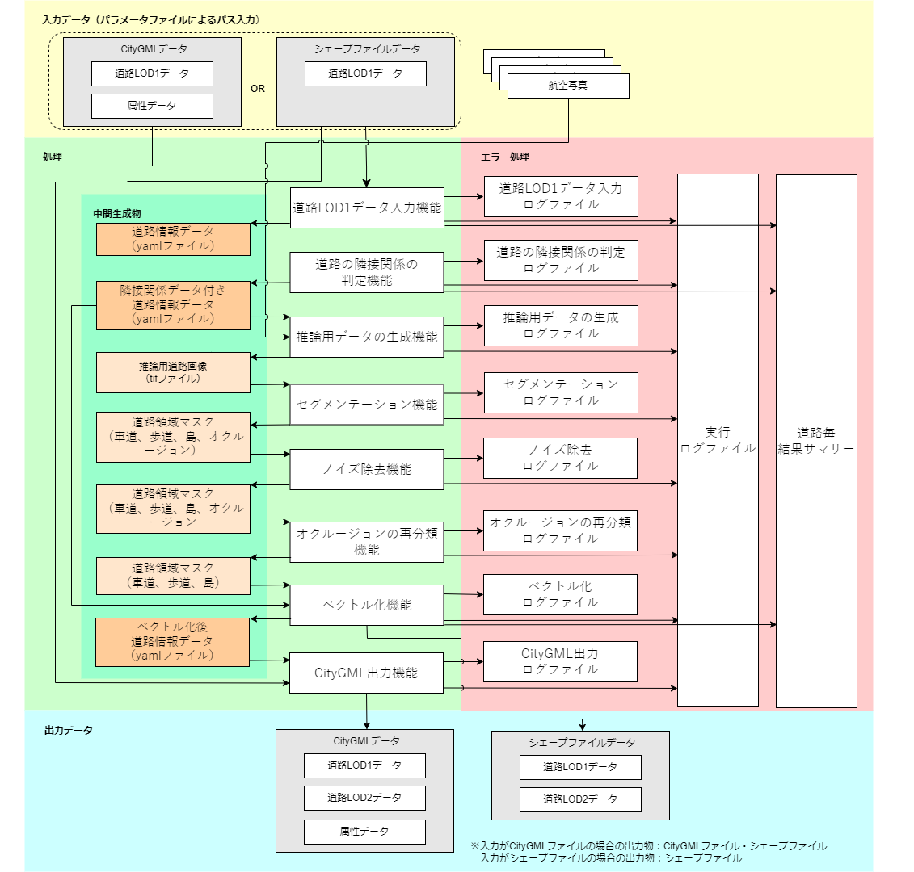
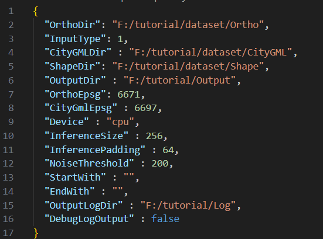
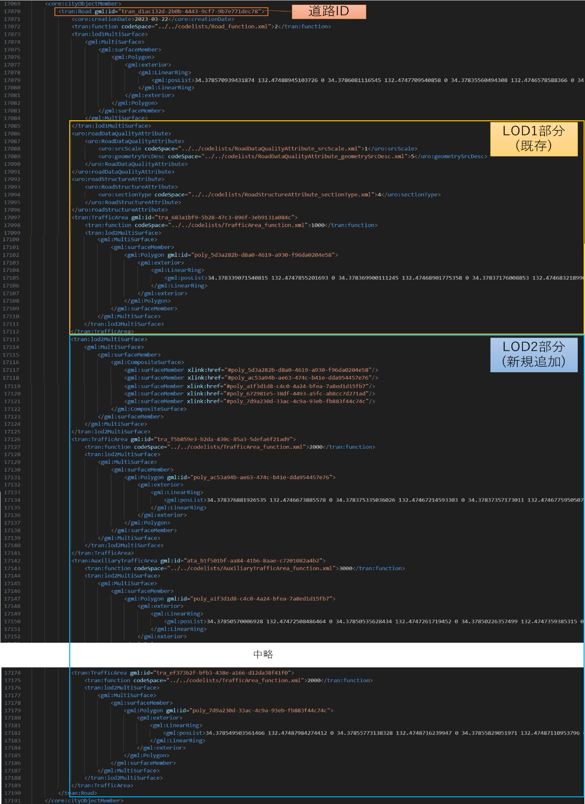
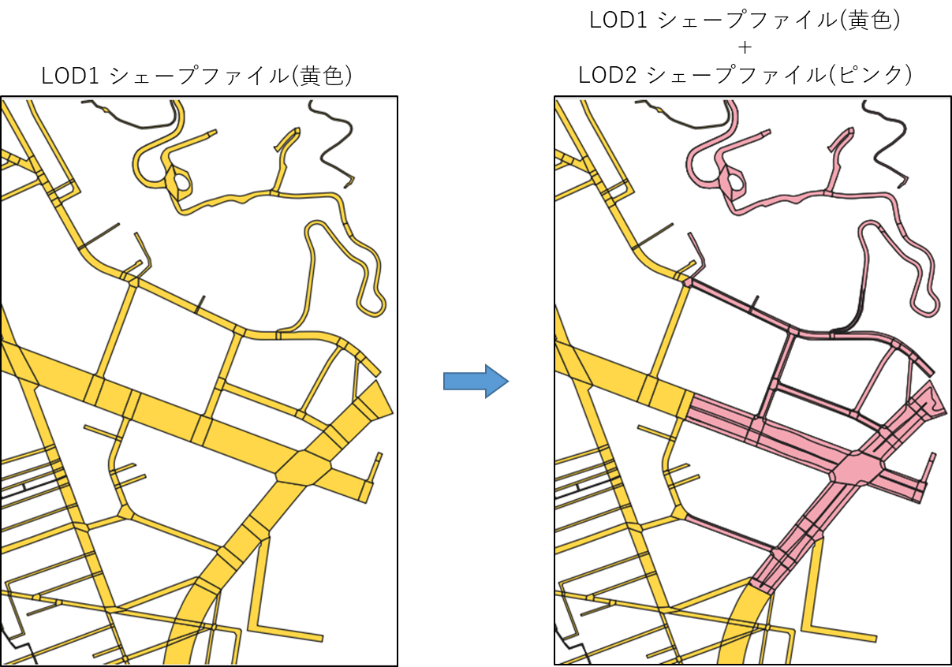
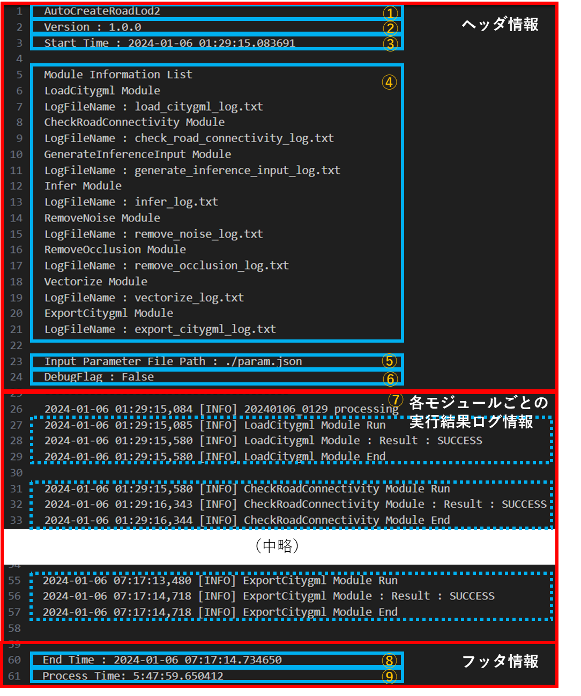
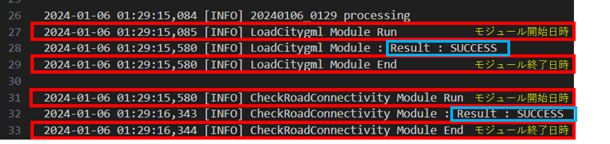
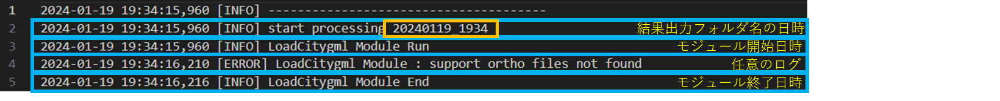
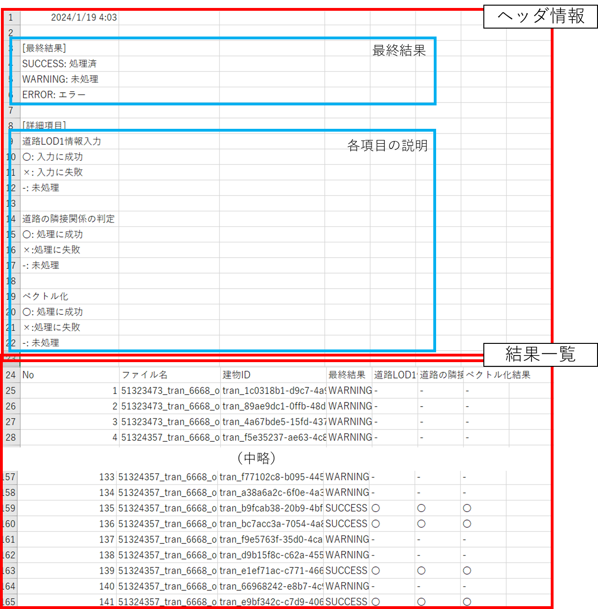
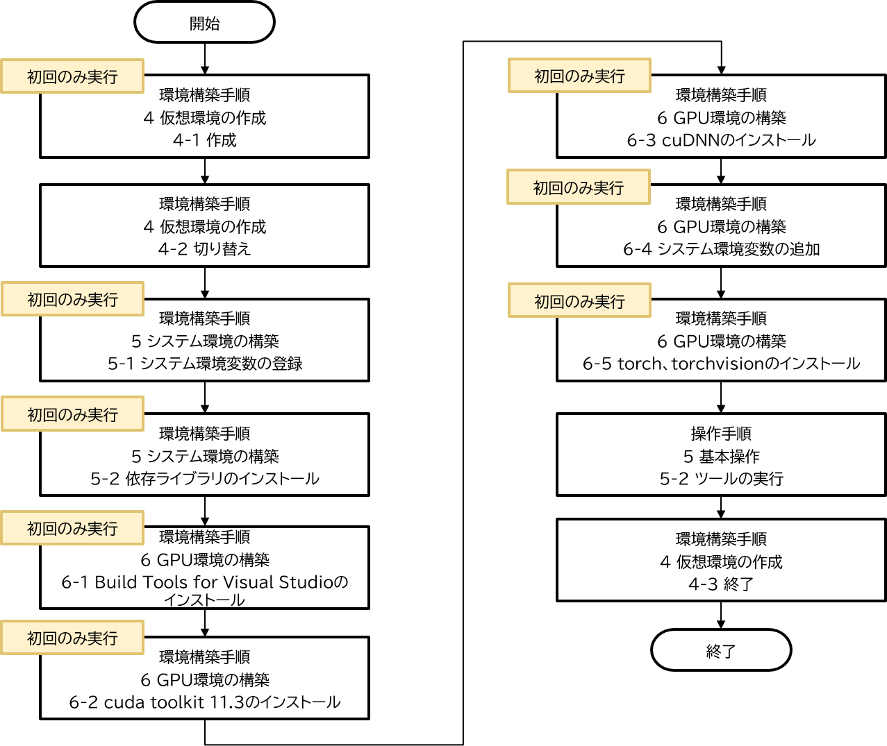

# 操作マニュアル

# 1 本書について

本書では、LOD2道路モデル自動生成ツール（以下「本ツール」という。）の操作手順について記載しています。

# 2 システム概要

航空写真（オルソ）や道路ポリゴンデータ等からCityGML形式およびシェープファイル形式の道路LOD2モデルを出力する機能を持つツールです。\
本ツールは、①道路LOD1データ入力機能、②LOD2モデル生成機能、③CityGML出力機能の3つの機能から構成されています。\
更に②LOD2モデル生成機能は、道路の隣接関係の判定機能、推論用データの生成機能、セグメンテーション機能、ノイズ除去機能、オクルージョンの再分類機能、ベクトル化機能のサブ機能から構成されます。各機能は独立していて、入力されたデータは順番に処理されます。\
ツール構成図を以下に示します。

<ツール構成図>


# 3 システム入力

## 3-1 入力ファイル一覧

以下に本ツールの入力ファイルを記載します。

<入力ファイル一覧>

| No | データ名	| 入力元| ファイルフォーマット | 説明
| -- | -------- | -------------- | -------- | -------- |
| 1  | 設定パラメータファイル | ツール実行時にコンソール指定 | jsonファイル | ・ツール実行時に使用するパラメータを記載するファイル（詳細は[3-2 設定パラメータファイル](#3\-2-設定パラメータファイル)参照） |
| 2  | LOD1 CityGMLファイル、もしくはシェープファイル | 設定パラメータファイルでパスを指定<br>CityGMLファイル：“CityGMLDir”キーにフォルダパス入力<br>シェープファイル：“ShapeDir”キーにフォルダパス入力 | CityGMLファイル、もしくはシェープファイル | ・ 道路LOD1データ<br>・ どちらを使用するかは設定パラメータファイルの”InputType”キーで指定する（詳細は[3-2 設定パラメータファイル](#3\-2-設定パラメータファイル)参照）<br>※シェープファイルの場合は、属性データを対応しない仕様とする |
| 3  | 航空写真(オルソ)群 | 設定パラメータファイルの「OrthoDir」キーに入力でフォルダパスを指定 | TIFFファイル | ・航空写真(原画像)から作成した、LOD2モデル化対象エリアの航空写真のオルソ画像<br>※AIモデルの学習では地上画素寸法12cm～16cmのオルソ画像が使用されていたため、この範囲外のオルソ画像を入力する場合は、認識精度が低下する可能性がある<br>※オルソ画像の最大ピクセル数は178956970以下とする |

## 3-2 設定パラメータファイル

本ツール実行時に使用するパラメータを記載するファイルです。

<設定パラメータファイルの仕様>

| ファイル形式 | ファイル名 | 格納フォルダ |入力先 | 特記事項 |
| ----------- | --------- | ----------- | ---- | -------- |
| JSON | param.json | 任意 | システム全般 | 文字コードはUTF-8とします。 |

設定パラメータファイルのパラメータ一覧を以下に記載します。

<設定パラメータ一覧>

| No | キー名 | 値形式 | 説明 |
| --------- | ----------- | ---- | -------- |
| 1 | OrthoDir | 文字列 | 推論に使用するオルソ画像(ワールドファイル付き)が保存されているディレクトリのパスを指定します。<br>指定されたフォルダパスが存在しない場合は無効とし、エラーメッセージを表示し、処理を中止します。 |
| 2 | InputType | 整数値 | 入力ファイルにCityGMLファイル・シェープファイルのどちらを使うかを指定します。指定がない場合は無効とし、エラーメッセージを表示し、処理を中止します。<br>１：CityGMLファイル<br>２：シェープファイル |
| 3 | CityGMLDir | 文字列 | 「InputType」にCityGMLファイルが指定されている場合に使用する、LOD1 CityGMLが保存されているディレクトリのパスを指定します。<br>指定されたフォルダパスが存在しない場合は無効とし、エラーメッセージを表示し、処理を中止します。 |
| 4 | ShapeDir | 文字列 | 「InputType」にシェープファイルが指定されている場合に使用する、LOD1 シェープファイルが保存されているディレクトリのパスを指定します。<br> 指定されたフォルダパスが存在しない場合は無効とし、エラーメッセージを表示し、処理を中止します。|
| 5 | OutputDir | 文字列 | 途中結果と最終結果を出力するディレクトリのパスを指定します。<br>指定されたフォルダパスが存在しない場合は無効とし、エラーメッセージを表示し、処理を中止します。 |
| 6 | OrthoEpsg | 整数値 | オルソ画像のワールドファイルに記載された座標のEPSGコードを指定します。<br>未記入の場合は無効とし、エラーメッセージを表示し、処理を中止します。 |
| 7 | CityGmlEpsg | 整数値 | CityGMLに記載されている座標のEPSGコードを指定します。<br>未記入の場合は無効とし、エラーメッセージを表示し、処理を中止します。 |
| 8 | 【任意】Device | 文字列 | 推論を実行するデバイスを指定します。GPUを指定する場合は、"cuda:#"で指定します。ここで"#"はGPUの番号となります（例："cuda:0"）。CPUのみの環境では"cpu"を指定します。 |
| 9 | 【任意】InferenceSize | 整数値 | 推論を行う際のタイルの1辺のサイズ(pixel) を指定します。 |
| 10 | 【任意】InferencePadding | 整数値 | 推論を行う際のタイルで推論結果を使用しない外側の幅(pixel) を指定します。 |
| 11 | 【任意】NoiseThreshold | 整数値 | 小さな領域の除去で除去する領域のピクセル数の閾値を指定します。 |
| 12 | 【任意】StartWith | 文字列 | 途中から実行したい場合の開始ステップ名を指定します。(load_citygml, check_road_connectivity, generate_inference_input, infer, remove_noise, remove_occlusion, vectorize, export_citygml) <br>output_dirにそのステップの直前までの結果が含まれている必要があります。|
| 13 | 【任意】EndWith | 文字列 | 途中で実行を止めたい場合の最後のステップ名を指定します。(load_citygml, check_road_connectivity, generate_inference_input, infer, remove_noise, remove_occlusion, vectorize, export_citygml) |
| 14 | OutputLogDir | 文字列 | ログのフォルダパスを指定します。<br>未記入または、存在しない場合は、本システムのPythonコードと同階層のログフォルダ“output_log”にログファイルを作成し、処理を中止します。 |
| 15 | DebugLogOutput | 真偽値 | デバッグレベルのログを出力するかどうかのフラグを指定します。<br>trueまたはfalseで値を指定します。<br>未記入、または、真偽値以外の値が入力された場合は、エラーメッセージを表示し、処理を中止します。 |

設定パラメータファイルの記載例を以下に示します。

<設定パラメータファイル記載例>



# 4 システム出力

## 4-1 出力ファイル一覧

以下に本ツールの出力ファイルを記載します。

<出力ファイル一覧>

| No | データ名 | 出力先 | ファイルフォーマット | 説明 |
| -- | ------- | ------ | ------------------ | ---- |
| 1 | LOD2 CityGMLファイル、もしくはシェープファイル | 設定パラメータファイル“OutputDir”キーで指定したフォルダパスに新規作成した[CityGMLFolder_YYYYMMDD_HHMM\8_lod2_output]（YYYMMDD_HHMMSSは作成時の時間）フォルダ（入力がシェープファイルの場合は[ShapeFolder_YYYYMMDD_HHMM\8_lod2_output]） | CityGMLファイル | ・LOD2の道路情報、及び属性データを持ったCityGMLデータ。<br>・入力データがCityGMLファイルの場合はCityGML ファイルとシェープファイルの両方を出力します。入力データがシェープファイルの場合はシェープファイルのみを出力します。 |
| 2 | ログファイル | 設定パラメータファイル“OutputLogDir”キーで指定したフォルダパスに新規作成した[outputlog_YYYMMDD_HHMMSS]（YYYMMDD_HHMMSSは作成時の時間） フォルダ<br>（未記入または、存在しない場合は、実行時のカレントフォルダにログフォルダ“output_log”を作成し、その中に[outputlog_YYYMMDD_HHMMSS]（YYYMMDD_HHMMSSは作成時の時間）フォルダを作成します） | txtファイル/csvファイル | ・[4-4 ログファイル](#4\-4-ログファイル)を参照してください。 |
| 3 | 中間生成ファイル | 設定パラメータファイル“OutputDir”キーで指定したフォルダパスに新規作成した[CityGMLFolder_YYYYMMDD_HHMM]（YYYMMDD_HHMMSSは作成時の時間）の以下フォルダ<br>・1_road_info<br>・2_road_info_with_neighbors<br>・3_inference_input<br>・4_inference_result<br>・5_inference_result_noiseless<br>・6_inference_result_without_occlusion<br>・7_vectorized | TIFファイル/YMLファイル | ・LOD2 CityGMLファイル、もしくはシェープファイルを出力するための中間生成ファイル群です。|

## 4-2 LOD2 CityGMLファイル

本ツールが出力するLOD2 CityGMLファイルは、入力LOD1 CityGMLファイルの道路情報にLOD2道路情報を追記したCityGMLファイルです。\
以下に、出力LOD2 CityGMLファイルの例を示します。

<出力LOD2 CityGMLファイル例>



## 4-3 LOD2 シェープファイル

本ツールが出力するLOD2 シェープファイルは、入力シェープファイルの道路情報にLOD2道路情報を追記したシェープファイルです。\
以下に、出力LOD2 シェープファイルの例を示します。

<出力LOD2 シェープファイル例>



## 4-4 ログファイル

### 4-4-1 出力ログファイル一覧

以下に出力ログファイル一覧を記載します。\
[No.1実行ログファイル]の詳細情報として、[No.2～6]の各モジュールログファイルを出力します。\
なお[No.1～6]は開発者向けログ、[No.7モデル化結果サマリーファイル]はユーザー向けログを想定しています。

<出力ログファイル一覧>

| No | データ名 | 出力ファイル名 | 説明 |
| -- | ------- | ------------- | ---- |
| 1 | 実行ログファイル | main_log.txt | ・本システムのログメッセージを出力します。 |
| 2 | 道路LOD1データ入力モジュールログファイル | load_citygml_log.txt | ・CityGML入力モジュールのログメッセージを出力します。 |
| 3 | 道路の隣接関係の判定モジュールログファイル | check_road_connectivity_log.txt | ・道路の隣接関係の判定のログメッセージを出力します。 |
| 4 | 推論用データの生成モジュールログファイル | generate_inference_input_log.txt | ・推論用データの生成モジュールのログメッセージを出力します。 |
| 5 | セグメンテーションモジュールログファイル | infer_log.txt | ・セグメンテーションモジュールのログメッセージを出力します。 |
| 6 | ノイズ除去モジュールログファイル | remove_noise_log.txt | ・ノイズ除去モジュールのログメッセージを出力します。 |
| 7 | オクルージョンの再分類モジュールログファイル | remove_occlusion_log.txt | ・オクルージョンの再分類モジュールのログメッセージを出力します。 |
| 8 | ベクトル化モジュールログファイル | vectorize_log.txt | ・ベクトル化モジュールのログメッセージを出力します。 |
| 9 | CityGML出力モジュールログファイル | export_citygml_log.txt | ・CityGML出力モジュールのログメッセージを出力します。 |
| 10 | 結果サマリーファイル | road_create_result.csv | ・各道路のモデル化結果ログを出力します。 |

### 4-4-2 実行ログファイル

#### 4-4-2-1 ログ構成

以下に実行ログファイルの構成を記載します。

<ログ構成>



| 出力場所 | 項目名 |
| ------- | ----- |
| ヘッダ情報 | ①　本ツール名<br>②　本ツールのバージョン<br>③　本ツールの起動時間<br>④　各モジュールの名前とモジュールログファイル名<br>⑤　設定パラメータファイルパス<br>⑥　モジュール動作中のデバッグログ出力フラグ |
| モジュールごとの実行結果ログ | ⑦　各モジュールのログ |
| フッタ情報 | ⑧　本ツールの終了時間<br>⑨　本ツールの稼働時間 |

[⑦各モジュールのログ]の例を以下に記載します。\
処理対象のCityGMLファイルごとに、各モジュールの結果概要(モジュール開始・終了日時、モジュール実施結果)が記載されます。

<各モジュールログ例>



ログファイルに出力されるログレベルの一覧を以下に記載します。

<ログレベル>

| ログレベル | 説明 |
| ------- | ----- |
| ERROR | 処理が途中終了するような致命的なエラー |
| MODEL_ERROR | LOD2道路モデルに関するエラー(生成エラーの場合等) |
| WARN | 問題ですが、処理を継続実行可能なエラー |
| INFO | モジュールの開始や終了などの情報 |
| DEBUG | システムの動作状況に関する詳細な情報<br>パラメータファイルにてDebugLogOutputがtrueに指定されている場合は、出力します |

#### 4-4-2-2 ログメッセージ

以下に実行ログファイルの主なログメッセージを記載します。\
開発者向けログである性質上、記載以外のメッセージが出力される場合があります。

<ログメッセージ>

| No | ログレベル | エラー文言 | 説明 |
| ------- | ----- | ------- | ----- |
| 1 | [ERROR] | parameter file does not exist. | 設定ファイルが存在しない。 |
| 2 | [ERROR] | OrthoDir is invalid. | 航空写真(オルソ)フォルダパスが文字列ではない。 |
| 3 | [ERROR] | OrthoDir not found. | 航空写真(オルソ)フォルダパスが存在しない。 |
| 4 | [ERROR] | InputType is invalid. | 入力ファイルタイプが数値ではない。 |
| 5 | [ERROR] | InputType not support. | 入力ファイルタイプに1,2以外の値を入力している。 |
| 6 | [ERROR] | CityGMLDir is invalid. | 入力CityGMLフォルダパスが文字列ではない。 |
| 7 | [ERROR] | CityGMLDir not found. | 入力CityGMLフォルダパスが存在しない。 |
| 8 | [ERROR] | ShapeDir is invalid. | 入力シェープファイルフォルダパスが文字列ではない。 |
| 9 | [ERROR] | ShapeDir not found. | 入力シェープファイルフォルダパスが存在しない。 |
| 10 | [ERROR] | OutputDir is invalid. | 結果出力先フォルダパスが文字列ではない。 |
| 11 | [ERROR] | [OutputDir] cannot make. | 生成モデルの出力先パスが作成不可能なディレクトリを指定している。<br>[OutputDir]には、実際のフォルダパスが記載される。 |
| 12 | [ERROR] | OutputLogDir is invalid. | ログ出力先フォルダパスが文字列ではない。 |
| 13 | [ERROR] | OrthoEpsg is invalid. | EPSGコード(オルソ画像) が数値ではない。 |
| 14 | [ERROR] | CityGmlEpsg is invalid. | EPSGコード(CityGML)が数値ではない。 |
| 15 | [ERROR] | DebugLogOutput is invalid. | デバッグログ出力フラグに真偽値以外の値を入力している。 |

### 4-4-3 モジュールログファイル

#### 4-4-3-1 ログ構成

モジュールログファイルの例を以下に記載します。\
各モジュールの詳細結果(モジュール開始・終了日時、モジュールの任意メッセージ)が記載されます。

<モジュールログ例(CityGML出力)>



#### 4-4-3-2 ログメッセージ

以下に各モジュールのエラーログファイルの主なログメッセージを記載します。
開発者向けログである性質上、記載以外のメッセージが出力される場合があります。

<道路LOD1データ入力モジュール　ログメッセージ>

| No | ログレベル | エラー文言 | 説明 |
| -- | --------- | --------- | ---- |
| 1 | [ERROR] | File not found | 入力CityGMLファイルもしくは入力シェープファイルが存在しない。 |
| 2 | [ERROR] | support ortho files not found | 入力CityGMLファイルに対応するオルソ画像が存在しない。 |
| 3 | [WARNING] | [モジュール結果中間出力フォルダ]already exists | 結果中間出力フォルダが既にある。 |
| 4 | [DEBUG] | [オルソ画像ファイル名数] ortho file | 入力されたオルソ画像ファイルの数を表示。 |

<道路の隣接関係の判定モジュール　ログメッセージ>

| No | ログレベル | エラー文言 | 説明 |
| -- | --------- | --------- | ---- |
| 1 | [WARNING] | [モジュール結果中間出力フォルダ]already exists | 結果中間出力フォルダが既にある。 |

<推論用データの生成モジュール　ログメッセージ>

| No | ログレベル | エラー文言 | 説明 |
| -- | --------- | --------- | ---- |
| 1 | [WARNING] | [モジュール結果中間出力フォルダ]already exists | 結果中間出力フォルダが既にある。 |

<セグメンテーションモジュール　ログメッセージ>

| No | ログレベル | エラー文言 | 説明 |
| -- | --------- | --------- | ---- |
| 1 | [WARNING] | [モジュール結果中間出力フォルダ]already exists | 結果中間出力フォルダが既にある。 |

<ノイズ除去モジュール　ログメッセージ>

| No | ログレベル | エラー文言 | 説明 |
| -- | --------- | --------- | ---- |
| 1 | [WARNING] | [モジュール結果中間出力フォルダ]already exists | 結果中間出力フォルダが既にある。 |

<オクルージョンの再分類モジュール　ログメッセージ>

| No | ログレベル | エラー文言 | 説明 |
| -- | --------- | --------- | ---- |
| 1 | [WARNING] | [モジュール結果中間出力フォルダ]already exists | 結果中間出力フォルダが既にある。 |
| 2 | [DEBUG] | remain occlusion, rewrite roadway | 連結成分内がオクルージョンのみの場合に車道(1)に書き換える際に表示。 |

<ベクトル化モジュール　ログメッセージ>

| No | ログレベル | エラー文言 | 説明 |
| -- | --------- | --------- | ---- |
| 1 | [WARNING] | [モジュール結果中間出力フォルダ]already exists | 結果中間出力フォルダが既にある。 |
| 2 | [WARNING] | [結果最終出力フォルダ]already exists | 結果最終出力フォルダが既にある。 |

< CityGML出力モジュール　ログメッセージ>

| No | ログレベル | エラー文言 | 説明 |
| -- | --------- | --------- | ---- |
| 1 | [WARNING] | [CityGMLファイル名] lod2 road data not found, write skip | 該当のCityGMLファイルに書き込むLOD2道路データが存在しないためスキップする。 |

### 4-4-4 モデル化結果サマリーファイル

#### 4-4-4-1 サマリー構成

各道路のモデル作成結果をcsvファイル形式で出力します。
出力例を以下に示します。

<モデル化結果出力例>


ヘッダ部分に出力日時と出力結果の説明が記載され、結果一覧に道路ごとの出力結果やモジュールごとの実行結果が記載されます。結果一覧の出力項目と内容について以下に示します。

<結果サマリーファイルの出力項目>

| No | 項目名 | 説明 |
| -- | ------ | ---- |
| 1 | No | 行番号 |
| 2 | ファイル名 | 道路情報が記載されているCityGMLファイル名もしくはシェープファイル名 |
| 3 | 道路ID | 道路ID |
| 4 | 最終結果 | SUCCESS：道路モデルの作成に成功<br>WARNING：対応オルソがないため道路モデルの作成を行わない |
| 5 | 道路LOD1データ入力 | 道路LOD1データ入力	〇：道路LOD1データの取得に成功<br>×：道路LOD1データの取得に失敗<br>-：道路LOD1データ作成対象外 |
| 6 | 道路の隣接関係の判定 | 〇：道路の隣接関係の判定結果のデータ追加に成功<br>×：道路の隣接関係の判定結果のデータ追加に失敗<br>-：道路の隣接関係の判定結果のデータ追加対象外 |
| 7 | ベクトル化 | 〇：ベクトル化に成功<br>×：ベクトル化に失敗<br>-：ベクトル化対象外 |

# 5 基本操作

本ツールの操作手順を記載します。\
本ツールに入力するデータの作成を行います。(入力データの詳細については、[3 システム入力](#3-システム入力)を参照してください。)\
まずは、写真測量ソフトウェアを用いて航空写真(原画像)から、航空写真(オルソ)を作成します。\
次に、航空写真の撮影エリアに該当するLOD1 CityGMLファイルを用意します。(G空間情報センターからCityGMLファイルをダウンロードすることを想定しています。)入力にシェープファイルを使用したい場合はユーザが用意します。

<入力ファイルの準備>


## 5-1  設定パラメータファイルの作成
入力ファイルの準備が完了したら、設定パラメータファイルの作成を行います。\
設定パラメータファイルの記載内容については、[3-2 設定パラメータファイル](#3\-2-設定パラメータファイル)を参照してください。\
設定パラメータファイルは本ツールの実行ファイル（AutoCreateRoadLod2.py）と同階層に配置してください。

## 5-2 ツールの実行
下図に操作手順を示します。

<操作手順>


本ツールを実行するにあたり、仮想環境を用意する必要があります。\
なお、仮想環境の構築は初回のみの作業です。仮想環境の構築手順の詳細は、環境構築手順書を参照してください。\
入力ファイルの準備、設定パラメータファイルの作成、および、仮想環境の構築が完了した場合は、仮想環境上で本ツールを実行します。

本ツールを実行する際のコマンドを以下に示します。(上図、操作手順のツールの実行で使用するコマンド)

```
> python AutoCreateRoadLod2.py param.json
```

AutoCreateRoadLod2.py : 本システムのPythonコード\
param.json : 設定パラメータファイルパス

本ツールの動作が終了した後は、仮想環境の終了動作を行うことで仮想環境から抜け出すことが出来ます。\
出力ファイルの確認を行う際は、以下フォルダの確認を行います。

| 出力ファイル | 出力場所 |
| ----------- | ------- |
| LOD2 CityGMLファイルまたはシェープファイル | 設定パラメータファイルのOutputDirで指定したフォルダ内の「CityGMLFolder_YYYYMMDD_HHMM\8_lod2_output」フォルダ<br>（入力がシェープファイルの場合は「ShapeFolder_YYYYMMDD_HHMM\8_lod2_output」） |
| ログファイル | 設定パラメータファイルのOutputLogDirで指定したフォルダ |
